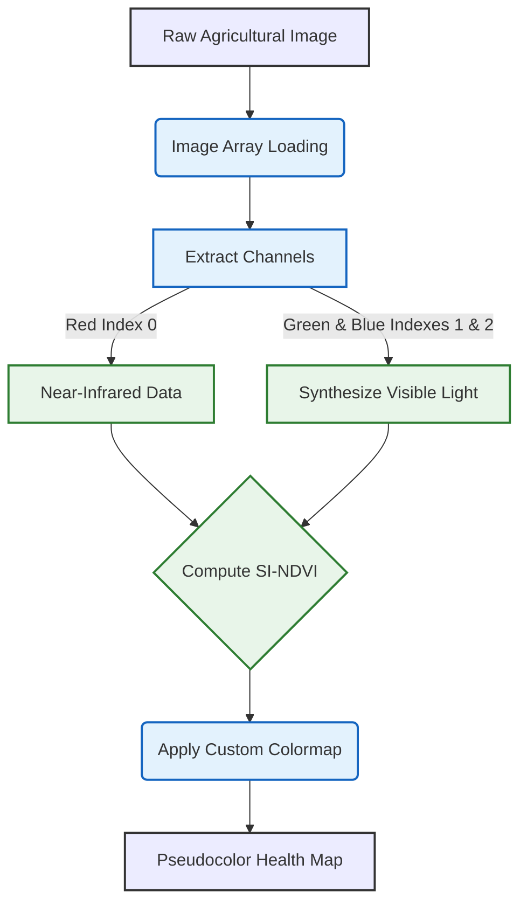

# SI-NDVI Crop early disease detection

## Overview

`NDVI.py` is a algorithm introduced to calculate the Single Image Normalized Difference Vegetation Index (SI-NDVI). It processes agricultural images taken with a modified NoIR camera to assess crop health, outputting a color-coded heatmap.

## Processing Pipeline



## Prerequisites
To run this script, you need Python installed along with the matplotlib library.

Install the required library using:

```bash
pip install matplotlib
```

## Usage

Run the script from the command line using the following syntax:

```bash
python NDVI.py -i <input_file.jpg> [-o <output_file.jpg>] [-c <colors>]
```

## Arguments:

* **`-i` or `--input_file`:** (Required) Path to the input image file.
* **`-o` or `--output_file`:** (Optional) Path for the generated output image. If not provided, the script appends `_output` to the original filename.
* **`-c` or `--colors`:** (Optional) Flag to pass custom colors for the colormap.

### Example:

```bash
python NDVI.py -i NDVI_input.jpg
```

## Working

The script processes the image sequentially:

1. **Channel Extraction:** The script reads the image array and assigns the Red channel as Near-Infrared (NIR), while keeping the Green and Blue channels for visible light.
2. **Visible Light Synthesis:** It mathematically models the visible light spectrum (VIS) using the remaining blue and green channels: 

$$VIS = \frac{(Blue + Green)^2}{(Blue - Green)^2}$$

3. **NDVI Calculation:** It applies the standard vegetation index formula to generate a value between -1.0 and 1.0 for each pixel: 

$$NDVI = \frac{NIR - VIS}{NIR + VIS}$$

4. **Image Generation:** The numerical values are plotted onto a pseudocolor image and saved.

## Result

The output file translates the calculated NDVI values into a visual health map. The default color gradient represents the following:

* **Gray (-1.0 to 0):** Non-photosynthetic matter (soil, water, shadows, or dead vegetation).
* **Red (Low Positive):** Stressed, diseased, or damaged plants requiring attention.
* **Yellow (Mid Positive):** Moderately healthy or transitioning vegetation.
* **Green (High Positive to 1.0):** Dense, healthy, and highly vigorous crops actively photosynthesizing.